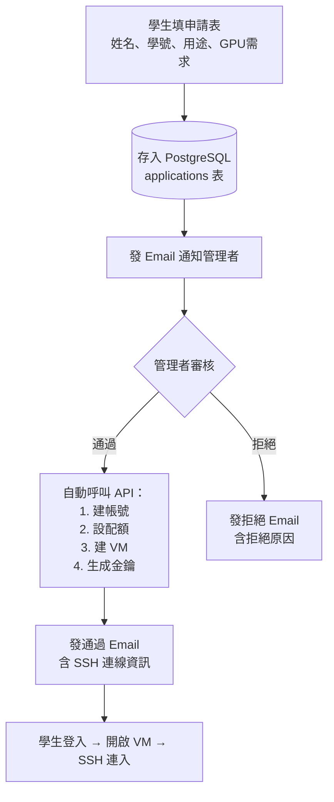

# GPU 算力平台 — Master 規格書

**最後更新日期：** 2026-04-16
**版本：** v1.0

**來源文件清單：**
- `新手架構指南.md` — 名詞解釋與整體架構圖
- `＿前端路由API對照表.md` — 功能地圖與 API 對照
- `系統架構規劃.md` — 微服務 + PostgreSQL 架構設計
- `GPU動態分配與VIP插隊評估.md` — 可行性評估與方案比較
- `article分析報告.md` — USER_PRIORITY 源碼驗證
- `API架構分析.md` — 三種通訊方式（HTTP / XML-RPC / WebSocket）
- `api-samples/INDEX.md` — 學校測試機真實 API 採集結果

---

## 1. 一頁懂概念（Executive Summary）

### 30 秒概覽

**這是什麼？** 一套讓學校師生透過網頁管理 GPU 虛擬機（VM）的平台。學生申請後，系統自動分配一台附有 GPU 的虛擬電腦，提供 SSH 連線資訊，讓學生用自己的電腦遠端執行深度學習等 GPU 運算。

**為什麼做？** 學校購置了高階 GPU 伺服器，但沒有友善的管理介面。OpenNebula 原本的 Sunstone 管理後台對一般師生太複雜，需要一套簡潔的中文介面。

**核心策略：前端換皮，不動後端。** 完整保留 OpenNebula 的基礎設施與 300+ 隻 API，在旁邊另外建一套簡化的前端與業務邏輯服務。

### 使用者角色

| 角色 | 主要操作 |
|------|---------|
| 學生 | 填申請表 → 等審核通過 → 開/關 VM → SSH 連入做運算 |
| 管理員/老師 | 審核申請 → 設定排程 → 監控資源 → VIP 插隊管理 |
| VIP 使用者 | 緊急情況下插隊優先取得 GPU 資源 |

---

## 2. 業務需求

### 2.1 申請審核流程



### 2.2 VIP 插隊機制

**USER_PRIORITY 機制**（源碼驗證確認有效）：
- 每台 VM 可設定 `USER_PRIORITY` 數值，越大越優先
- OpenNebula 排程器每次運行時，優先分配資源給高 Priority 的 VM
- **限制**：只影響排隊順序，不會強制搶占正在運行的 VM

**完整 VIP 方案 = 三層組合：**

| 層 | 機制 | 現有 API |
|----|------|---------|
| 優先排隊 | USER_PRIORITY=100 | `PUT /template/instantiate/:id` extra: `USER_PRIORITY=100` |
| 自動到期 | VM 建立時設定排程，N 小時後自動 poweroff | `POST /vm/schedadd/:id` |
| 緊急搶占 | 管理員一鍵暫停佔用者，啟動 VIP VM | `PUT /vm/action/:id` body: `{action:"stop/resume"}` |

**插隊操作流程：**

```
管理員點「VIP 插隊」
 → GET /host/info/:id 確認 GPU 被誰佔用（PCI_DEVICES.VMID）
 → PUT /vm/action/:vmId {action:"stop"} 暫停佔用者（GPU 釋放）
 → PUT /vm/action/:vipVmId {action:"resume"} 啟動 VIP VM
 → VIP 結束後反向操作（stop VIP → resume 原使用者）
```

---

## 3. 系統架構

### 3.1 整體架構圖

```
┌──────────────────────────────────────────────────────────────┐
│  瀏覽器                                                        │
│  GPU 算力平台前端（React + Vite，Port 3000）                   │
│  學生 + 管理員介面，繁體中文                                    │
└────────────────────────┬─────────────────────────────────────┘
                         │ HTTP / API
                         ▼
┌──────────────────────────────────────────────────────────────┐
│  GPU Platform 微服務（Express.js，Port 4000）  ← 新開發         │
│                                                               │
│  ┌──────────────────────┐   ┌──────────────────────────────┐  │
│  │  自建業務 API         │   │  代理轉發 API                 │  │
│  │  /api/applications   │   │  /api/one/* → FireEdge       │  │
│  │  /api/schedules      │   │  同時記錄 audit_logs          │  │
│  │  /api/vip            │   └──────────────────────────────┘  │
│  │  /api/audit          │                                      │
│  │  /api/dashboard      │                                      │
│  └──────────┬───────────┘                                      │
│             │ 讀寫                                              │
│  ┌──────────▼───────────┐                                      │
│  │  PostgreSQL（Port 5432）  ← 業務資料（不含 OpenNebula 資料） │
│  └──────────────────────┘                                      │
└────────────────────────┬─────────────────────────────────────┘
                         │ HTTP 轉發
                         ▼
┌──────────────────────────────────────────────────────────────┐
│  FireEdge（Port 2616）  ← 完全不動                              │
│  Node.js + Express + Socket.IO                               │
│  功能路由 83 個 + XML-RPC 代理路由 283 個 + WebSocket 2 種     │
└────────────────────────┬─────────────────────────────────────┘
                         │ XML-RPC
                         ▼
┌──────────────────────────────────────────────────────────────┐
│  OpenNebula Daemon (oned，Port 2633）  ← 完全不動               │
│  VM/Host/Template/User 管理、排程器（含 USER_PRIORITY）         │
└────────────────────────┬─────────────────────────────────────┘
                         │
                         ▼
┌──────────────────────────────────────────────────────────────┐
│  GPU Host（實體伺服器）                                         │
│  KVM 虛擬化 + NVIDIA GPU（Passthrough / vGPU / MIG）           │
└──────────────────────────────────────────────────────────────┘
```

### 3.2 為什麼不改 OpenNebula？

| 原因 | 說明 |
|------|------|
| 維護成本高 | OpenNebula 持續更新，改了原始碼就無法輕易升級 |
| 風險高 | oned 是 C++ 核心，改錯會影響所有 VM 穩定度 |
| API 已夠用 | 現有 300+ 隻 API 已覆蓋所有需求，差的是業務層 |
| 兩套並存 | 新平台跑 Port 3000，Sunstone 原本的 Port 2616 繼續供管理員進階操作 |

### 3.3 Port 規劃

| 服務 | Port | 負責開發 |
|------|------|---------|
| GPU 算力平台前端 | 3000 | 需新開發 |
| GPU Platform 微服務 | 4000 | 需新開發 |
| PostgreSQL | 5432 | 需新開發 |
| FireEdge | 2616 | 不動 |
| oned | 2633 | 不動 |
| Guacamole (guacd) | 4822 | 不動 |

---

## 4. 技術選型

| 層級 | 技術 | 選用原因 |
|------|------|---------|
| **前端** | React + Vite | 現代開發體驗，Vite 比 Webpack 快很多；OpenNebula 原本用 React，生態相容 |
| **前端狀態** | TanStack Query 或 RTK Query | API 快取 + 自動載入狀態管理 |
| **前端 UI** | Tailwind CSS 或 MUI | 快速搭建中文介面 |
| **行事曆** | FullCalendar | 成熟的拖放排程元件 |
| **微服務** | Express.js | 輕量，Node.js 生態，與 FireEdge 同語言好維護 |
| **ORM** | Prisma 或 Knex.js | 型別安全或彈性 Query Builder |
| **Email** | nodemailer | Node.js 標準選擇 |
| **API 代理** | http-proxy-middleware | 轉發到 FireEdge 並插入審計邏輯 |
| **資料庫** | PostgreSQL | 結構化業務資料，JSONB 支援彈性欄位 |

---

## 5. OpenNebula 能力盤點

### 5.1 可直接用（串接 API 即可）

| 功能 | API |
|------|-----|
| VM 建立/開機/關機/刪除 | `PUT /template/instantiate/:id`、`PUT /vm/action/:id` |
| VM 詳情（含 GPU 監控） | `GET /vm/info/:id`（MONITORING 欄位含 GPU_UTILIZATION 等） |
| Host 詳情（含 GPU 狀態） | `GET /host/info/:id`（PCI_DEVICES 含 DEVICE_NAME、VMID） |
| 使用者 CRUD | `POST /user/allocate`、`PUT /user/quota/:id` |
| 排程動作（定時開關機） | `POST /vm/schedadd/:id`（支援週期性） |
| 快照與備份 | `POST /vm/snapshotcreate/:id`、`POST /vm/backup/:id` |
| 權限管理（群組/ACL） | `POST /group/allocate`、`POST /acl/addrule` |
| Web SSH Terminal | Guacamole WebSocket（`GET /vm/:id/guacamole/ssh`） |

### 5.2 需自建（OpenNebula 沒有）

| 功能 | 原因 |
|------|------|
| 申請審核流程 | OpenNebula 使用者由管理員直接建，無申請/審核流程 |
| 行事曆排程 UI | Sunstone 只有排程動作表單，無日曆視圖 |
| VIP 插隊按鈕 | API 可做到（stop/resume），但業務邏輯需自建 |
| 操作審計日誌 | OpenNebula 無 API 操作記錄（誰/何時/做了什麼） |
| Email 通知 | OpenNebula 無 Email 系統 |

### 5.3 三大重大發現（來自真實 API 採集，2026-04-16）

**發現一：GPU 監控原生支援，不需 DCGM**

`GET /vm/info/:id` 的 `MONITORING` 欄位直接包含：
```
GPU_COUNT、GPU_UTILIZATION、GPU_MEMORY_FREE、GPU_MEMORY_UTILIZATION
GPU_POWER_USAGE、GPU_UTILIZATION_FORECAST（ML 預測）
```
影響：GPU 監控看板直接呼叫現有 API，不需部署額外服務。

**發現二：PCI_DEVICES 含完整人類可讀型號**

`GET /host/info/:id` 的 `HOST_SHARE.PCI_DEVICES` 欄位包含：
```
DEVICE_NAME: "NVIDIA Corporation AD104 [GeForce RTX 4070 Ti]"
VENDOR_NAME: "NVIDIA Corporation"
VMID: "0"（哪台 VM 在用，-1 表示空閒）
```
影響：GPU 資源看板可直接渲染，不需維護 vendor ID 對照表。

**發現三：DHCP 模式下 VM 的 IP 取不到**

測試機 VM 使用 DHCP Bridge 網路，`MONITORING` 欄位無 ETH0_IP（QEMU Guest Agent 被停用）。

解法（二擇一）：
1. 改用固定 IP 網路（`vxlan-private`，172.16.10.0/24），IP 會出現在 NIC 欄位
2. 在 VM 內安裝 `qemu-guest-agent`，重啟後 IP 出現在 MONITORING

**附帶發現：SSH Key Bug**

現有 GPU Template 的 SSH_PUBLIC_KEY 寫死 root key，學生無法用自己的 key 登入。自建微服務建立 Template 時須設為 `$USER[SSH_PUBLIC_KEY]`，且學生帳號的 USER_TEMPLATE 要先寫入其 SSH 公鑰。

---

## 6. GPU 模式與限制

### 6.1 三種 GPU 分配模式

| 模式 | 說明 | 最多幾人共用一張卡 | 需要額外授權 |
|------|------|-------------------|------------|
| **Passthrough（直通）** | 一張 GPU 獨佔給一台 VM，效能最強 | 1 人 | 否 |
| **vGPU（軟體切片）** | 多 VM 輪流用 GPU 運算核心，有算力損耗 | 10+ 人 | 需 NVIDIA GRID 授權 |
| **MIG（硬體隔間）** | 硬體層級切成獨立小 GPU，效能穩定 | 最多 7 人 | 只有 A100/H100 支援 |

**學校測試機現狀：** RTX 4070 Ti（消費級），只支援 Passthrough 模式。

**正式環境：** 規格待定，若採用 A100/H100 則可考慮 MIG（給 VIP 預留獨立切片）。

### 6.2 Passthrough 模式下的 VIP 插隊限制

USER_PRIORITY 在 Passthrough 模式下只解決「誰先排到」，不解決「馬上拿到」。GPU 不會自動釋放，必須搭配：

- 自動到期（排程 poweroff）讓 GPU 定期釋放
- 管理員手動 stop 佔用者（VIP 緊急插隊按鈕）

---

## 7. 自建範圍清單

### P0 — MVP 必須自建

| 功能 | 為什麼自建 | 用到的 API | 估計工作量 |
|------|-----------|-----------|-----------|
| 申請審核流程 | OpenNebula 沒有 | `POST /user/allocate`、`PUT /user/quota/:id`、`PUT /template/instantiate/:id` | 大 |
| 審核後自動建帳串接 | 需串接多步驟 API | 同上 | 中 |
| VIP 插隊 API + 按鈕 | 業務邏輯需自建 | `GET /host/info/:id`、`PUT /vm/action/:id` | 中 |
| 操作審計日誌 | OpenNebula 無此功能 | 中間層攔截記錄 | 中 |
| Email 通知系統 | OpenNebula 無此功能 | 無（nodemailer 自建） | 中 |

### P1 — 建議自建（核心功能完整性）

| 功能 | 為什麼自建 | 用到的 API | 估計工作量 |
|------|-----------|-----------|-----------|
| 行事曆排程 UI | OpenNebula 無日曆視圖 | `POST /vm/schedadd/:id`、`PUT /vm/action/:id` | 大 |
| GPU 資源總覽看板 | 需聚合多台 Host 資料 | `GET /hostpool/info`、`GET /host/info/:id` | 中 |
| Email 驗證/註冊流程 | 提升帳號安全性 | `POST /user/allocate` | 中 |
| GPU 數量配額（間接） | 配額 API 不支援 GPU 計數 | `PUT /user/quota/:id`（用 CPU 間接限制） | 小 |
| 使用時數限制 | 需自建計時邏輯 | `POST /vm/schedadd/:id` body: `{action:"poweroff"}` | 中 |

### P2 — 後期優化

| 功能 | 說明 | 估計工作量 |
|------|------|-----------|
| 活動紀錄查詢 | 登入歷史，等需求明確再加 | 小 |
| SSH Key 管理 UI | 學生可先用 Guacamole Web SSH | 小 |
| GPU 時數計費 | Showback 不含 GPU，需自建計費引擎或用 CPU_COST 間接算 | 大 |
| 自訂儀表板元件 | 先做固定版面 | 中 |

---

## 8. 資料庫設計

**設計原則：兩個 DB 各管各的。** OpenNebula 有自己的 SQLite/MySQL，不動它。自建 PostgreSQL 只存業務邏輯資料。

### 8.1 七張資料表（名稱與用途）

| 資料表 | 用途 |
|-------|------|
| `applications` | 學生申請單（姓名、學號、Email、用途、GPU 需求、狀態） |
| `application_reviews` | 審核紀錄（審核者、決定、原因、對應的 OpenNebula user_id / vm_id） |
| `schedules` | 行事曆排程（VM ID、時段開始/結束、重複類型） |
| `vip_preemptions` | VIP 插隊紀錄（VIP VM、被暫停 VM、時間、狀態） |
| `audit_logs` | 操作審計日誌（誰、什麼時間、做了什麼、HTTP 狀態碼） |
| `login_history` | 登入活動（user_id、IP、瀏覽器、動作） |
| `email_notifications` | Email 發送紀錄（收件者、類型、狀態、失敗原因） |

> **附選：** `gpu_metrics` 表可選用，定期從 VM/Host API 快照 GPU 數據供歷史趨勢圖使用。主要監控直接打 OpenNebula API，不一定需要此表。

相關文件：`系統架構規劃.md`（含完整 SQL 建表語句）

---

## 9. API 文件導讀

### 9.1 兩份 yml 怎麼看

| 文件 | 涵蓋範圍 | 使用時機 |
|------|---------|---------|
| `xmlrpc-api.yml` | 283 個 XML-RPC 代理路由（VM/Host/Template/User CRUD） | 查「有沒有某個 CRUD API」、「參數格式是什麼」 |
| `one-api.yml` | 83 個功能路由（登入、Guacamole、檔案上傳等） | 查「特殊功能 API 怎麼用」 |

**三種通訊方式：**
- **XML-RPC 代理路由（283 個）：** 純轉發，映射到 OpenNebula XML-RPC，零業務邏輯
- **功能路由（83 個）：** 有自訂 handler，含加密、檔案 I/O、跨系統整合
- **WebSocket：** Hook 事件（Socket.IO，VM 狀態即時推送）+ Guacamole（VNC/SSH 連線）

> WebSocket 未收錄在 yml 中，完整說明見 `API架構分析.md`。

### 9.2 api-samples/ 怎麼用

`api-samples/` 是 2026-04-16 從學校測試機（10.1.1.79）採集的真實 API 回應，用來確認資料欄位格式。

**最重要的兩個檔案：**
- `vm/vm-info-0.json` — VM 詳情，含 GPU 監控欄位
- `host/host-info-0.json` — Host 詳情，含 PCI_DEVICES（GPU 型號、使用狀態）

**認證方式（此環境特殊）：** 測試機不用 cookie，需要 Bearer Token：
```
POST /fireedge/api/auth/ → 取得 token
Authorization: Bearer <token>  ← 後續所有請求帶此 header
```

相關文件：`api-samples/INDEX.md`

---

## 10. 開發路線圖

### 第一階段：MVP（最小可用版本）

**目標：** 學生能申請帳號 → 管理員審核 → 學生拿到 GPU VM 並用 SSH 連入

| 任務 | 說明 |
|------|------|
| Express 微服務骨架 | PostgreSQL 連線、/api/one/* 代理轉發 |
| 申請審核流程 | 申請表單 + 待審核列表 + 通過/拒絕 + 自動建帳串接 |
| Email 通知 | 審核通知 + 結果通知（含 SSH 連線資訊） |
| React 前端 | 登入頁 + 申請表單 + VM 列表 + VM 開關機 |
| SSH IP 問題修正 | 改用固定 IP 網路或啟用 QEMU Guest Agent |
| SSH Key Bug 修正 | GPU Template 改為 `$USER[SSH_PUBLIC_KEY]` |

### 第二階段：核心功能

**目標：** 管理員能排程 + VIP 能插隊 + GPU 資源可視化

| 任務 | 說明 |
|------|------|
| 行事曆排程 | FullCalendar 前端 + 後端呼叫 vm.schedadd |
| VIP 插隊 | 一鍵插隊按鈕 + stop/resume 自動化邏輯 |
| GPU 資源看板 | 聚合 hostpool/info + PCI_DEVICES 視覺化 |
| 操作審計日誌 | API Proxy 攔截層記錄所有操作 |
| VM 狀態即時更新 | Socket.IO Hook 事件訂閱（VM 開關機即時顯示） |

### 第三階段：進階功能

**目標：** 完整營運管理

| 任務 | 說明 |
|------|------|
| GPU 監控歷史圖表 | 定期輪詢 vm/info MONITORING，存 gpu_metrics 表 |
| 使用時數統計 | 自建計時邏輯，或用 CPU_COST 搭配 Showback |
| 學生自助預約 | 行事曆開放學生自助申請時段 |
| 活動紀錄查詢 | 登入歷史、操作記錄查詢頁面 |

### 已知風險與待解問題

| 風險 | 說明 | 因應方式 |
|------|------|---------|
| SSH IP 問題 | 測試機 DHCP 模式取不到 IP | 正式環境改用固定 IP 網路 |
| SSH Key Bug | 現有 GPU Template 寫死 root key | 建立新 Template 修正 |
| GPU 配額無法直接控制 | OpenNebula 配額不支援 GPU 計數 | 用 CPU 配額間接限制 |
| Passthrough 熱插拔限制 | VM 運行中無法動態增減 GPU | 接受此限制，用時間分片替代 |
| 正式環境 GPU 規格未定 | 測試機是消費級 RTX 4070 Ti | 正式環境採購後確認是否支援 MIG |

---

## 附錄 A — 名詞表

| 名詞 | 說明 |
|------|------|
| OpenNebula | 開源雲端管理平台，整個系統的基礎 |
| oned | OpenNebula Daemon，C++ 核心引擎，真正管理 VM |
| FireEdge | Node.js 中間層，前端與 oned 之間的翻譯官 |
| Sunstone | OpenNebula 原本的 React 管理後台（不是我們要做的） |
| XML-RPC | oned 接受的遠端呼叫協議，FireEdge 幫我們轉換 |
| RTK Query | Redux Toolkit Query，前端 API 狀態管理套件 |
| Guacamole | Apache 開源遠端桌面閘道，支援 VNC/SSH/RDP |
| KVM | Linux 內建虛擬化引擎，GPU Host 上跑的引擎 |
| VM Template | 建立 VM 的預設規格（CPU/RAM/GPU/OS 組合） |
| USER_PRIORITY | OpenNebula 排程優先級欄位，控制 VM 排隊順序 |
| Passthrough | GPU 整張卡直通給一台 VM 獨佔 |
| MIG | Multi-Instance GPU，A100/H100 的硬體切片功能 |
| vGPU | NVIDIA 軟體切片技術，需 GRID 商業授權 |
| DCGM | NVIDIA Data Center GPU Manager，GPU 監控工具 |
| PCI_DEVICES | OpenNebula Host 上的 GPU 裝置清單（API 欄位） |

## 附錄 B — 參考文件清單

| 文件 | 路徑 |
|------|------|
| 新手架構指南 | `company-docs/新手架構指南.md` |
| 前端路由 API 對照表 | `company-docs/＿前端路由API對照表.md` |
| 系統架構規劃（含 DB SQL） | `company-docs/系統架構規劃.md` |
| GPU 動態分配與 VIP 插隊評估 | `company-docs/GPU動態分配與VIP插隊評估.md` |
| USER_PRIORITY 源碼驗證 | `company-docs/article分析報告.md` |
| API 架構分析（WebSocket 文件） | `company-docs/API架構分析.md` |
| 真實 API 採集索引 | `company-docs/api-samples/INDEX.md` |

## 附錄 C — 學校測試環境

| 項目 | 資訊 |
|------|------|
| 伺服器 IP | 10.1.1.79 |
| FireEdge Port | 2616 |
| GPU | NVIDIA RTX 4070 Ti（消費級，不支援 vGPU/MIG） |
| OpenNebula 版本 | 7.x |
| 網路 | DHCP Bridge (`lan-dhcp-onebr3`) + 固定 IP (`vxlan-private` 172.16.10.0/24) |
| 認證方式 | Bearer Token（非 cookie，測試機特殊） |
| 現有 Template | Ubuntu 24.04 普通版 (ID=0) + GPU 版 (ID=1，有 SSH Key Bug) |
