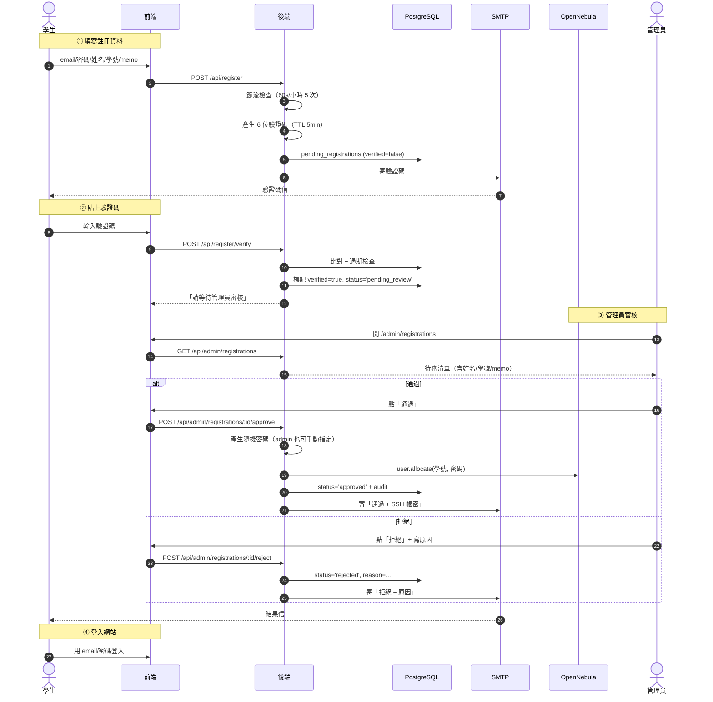
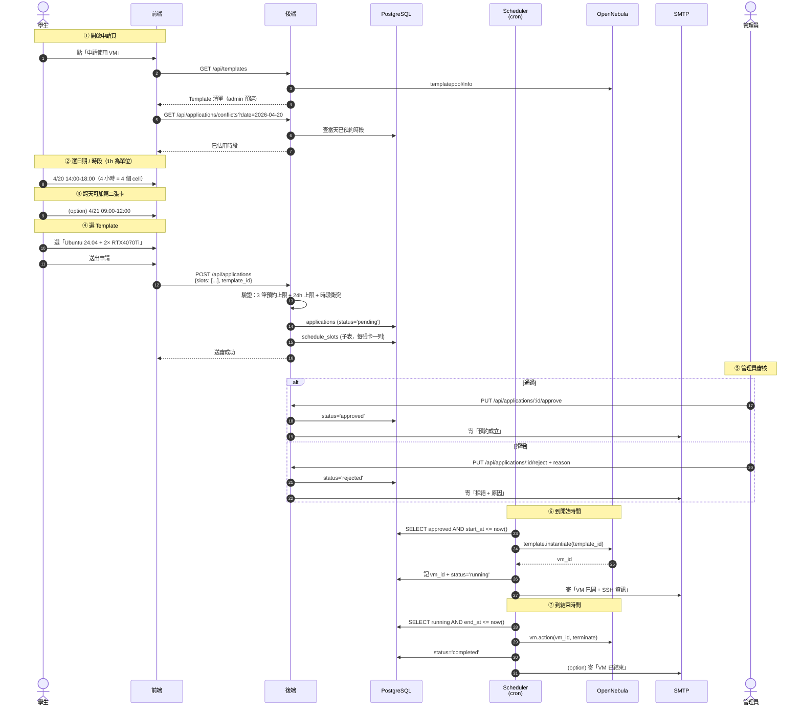

# GPU 算力平台 Spec V2 — 學生註冊與預約制申請

> 會議決議日期：**2026-04-17**
> 本文件取代/補充 MVP 階段的註冊與申請流程

---

## ⭐ 重大變動（影響既有功能）

| # | 變動 | 影響 |
|---|---|---|
| **C1** | **移除 SSH Key 機制**，改用 SSH 帳號 + 密碼 | `/settings/ssh-key` 頁面與 `routes/sshKey.js` 將 deprecate；學校 Template 不必再注入 `$USER[SSH_PUBLIC_KEY]` |
| **C2** | 申請 VM **不用輸入 4 欄位（CPU/RAM/Disk/GPU）**，改成 admin 預先建好多個 OpenNebula Template，學生**選 Template** | `Apply.jsx` 大改寫；新增 `/api/templates` 拉學校已建的 Template 清單 |
| **C3** | 學生**註冊**流程從「admin 直接建帳號」改為「**學生自行註冊 → 信箱驗證 → admin 審核**」 | 全新流程，需新增 DB 表、API、學生端 UI |
| **C4** | 申請流程從「自由寫用途」改為「**預約特定時段 + Template**」 | applications schema 要 migration，新增 start_at / end_at / template_id 欄位 |

---

## 📋 Q&A 完整紀錄

### 註冊流程

| # | 問題 | 答案 |
|---|---|---|
| **R1** | 「學校信箱驗證」的判斷邏輯？（A. domain whitelist / B. 預先匯入名單 / C. 任何 email 都收靠後台把關） | **C. 後台把關**（任何 email 都能註冊，admin 審核時把關） |
| **R2** | 驗證碼形式？ | **6 位數字**，有效 5 分鐘 |
| **R3** | 重寄驗證碼節流？ | **60 秒一次，每小時最多 5 次** |
| **R4** | OpenNebula 帳號何時建？（A. 信箱驗證後就建 / B. admin 審核通過才建） | **B. admin 審核通過才建** |
| **R5** | 註冊欄位？ | **email + 密碼 + 姓名 + 學號 + memo**（memo 可寫系所） |
| **R6** | 拒絕後同 email 能再註冊？ | **可以**（誤拒可重來） |

### 申請流程

| # | 問題 | 答案 |
|---|---|---|
| **A1** | 「選時段」= 預約 GPU 時段嗎？ | **是**，獨佔指定時段 |
| **A2** | 時段衝突怎麼顯示與處理？ | **GPU 庫存制**：學校共 8 張 GPU（編號 1–8），PCI 直通 → 每張同時段只能 1 台 VM。<br>• 學生申請寫「我要 N 張 GPU」<br>• Admin 審核時系統檢查：該時段「已通過 + 待審 + 申請中 GPU 總量」+ 本筆 ≤ 8<br>• 通過時系統**自動分配 GPU 編號**（最佳化分組）<br>• 一台 VM 最多 8 卡（吃滿） |
| **A3** | VM 規格如何輸入？ | **混合模式**：<br>• admin 預建多個 Template（含 OS image 與預設規格）<br>• 學生選 Template + **可微調 4 欄位**（CPU/RAM/Disk/GPU 數量）<br>• Template 提供預設值，學生可在合理範圍內覆寫 |
| **A4** | 跨日預約？ | 一天一個卡片，**跨天 = 同一 order 內加第二張卡** |
| **A5** | 時段到了 VM 自動開？ | **是**，到開始時間自動 instantiate，到結束時間自動 terminate |
| **A6** | 同學可同時持有幾筆預約？ | 後台兩個變數：**預設 3 筆預約上限 + 每筆預約上限 24 小時**（admin 可調） |
| **A7** | 審核通過 = 預約成立？還是立刻開 VM？ | **通過 = 預約成立**，到時間才自動開 |
| **A8** | 拒絕審核處理？ | **email 通知學生 + 寫拒絕原因** |

### 通知/帳號

| # | 規則 |
|---|---|
| **N1** | 註冊審核**通過**：email 給學生「**SSH 帳號 + 密碼**」 |
| **N2** | 註冊審核**拒絕**：email 給學生「**拒絕原因**」 |
| **N3** | 申請審核**通過**：email 給學生「預約成立」 |
| **N4** | 申請審核**拒絕**：email 給學生「拒絕原因」 |
| **N5** | VM 自動開機：email 給學生「VM 已開 + SSH 連線資訊（IP/Port/帳密）」 |

### 帳號 / 密碼 / 提醒

| # | 規則 |
|---|---|
| **P1** | OpenNebula 帳號 = **學號**（短、唯一、好打字） |
| **P2** | 密碼：**後端隨機產 12 碼**（A-Z + a-z + 0-9 + 特殊字元），admin 可手填覆蓋 |
| **P3** | VM 開始前**不寄提醒**（先不做） |

### 資源約束（Spec V2 核心）

> 學校 host 是**單機**，所有 VM 共用同一池 CPU / RAM / GPU 資源。
> 「審核」階段必須檢查同時段所有資源加總是否超過上限。

| # | 規則 |
|---|---|
| **R1** | **GPU**：共 **8 張**（編號 1–8），全在 1 台 host |
| **R2** | **PCI 直通模式**：同一張 GPU 同時段只能被 1 台 VM 使用（不能多 VM 共享） |
| **R3** | 一台 VM 最多吃 **8 卡**（吃滿） |
| **R4** | **CPU 上限**：admin 在 system_settings 設 `max_total_cpu`（例：32 核）。同時段所有 VM 的 CPU 加總 ≤ 上限 |
| **R5** | **RAM 上限**：admin 在 system_settings 設 `max_total_ram_gb`（例：64 GB）。同時段所有 VM 的 RAM 加總 ≤ 上限 |
| **R6** | **磁碟上限**：admin 在 system_settings 設 `max_total_disk_gb`（例：2000 GB）。同上 |
| **R7** | Admin 審核時系統**逐項檢查**該時段「已通過 + 待審 + 進行中」CPU/RAM/Disk/GPU 加總 + 本筆 ≤ 各自上限。**任一超過 → 跳警告 + 通過鈕禁用 + admin 只能拒絕** |
| **R8** | Admin 通過時系統**自動分配具體 GPU 編號**（例：A 學生分到 1-3，B 學生分到 4-7，C 學生分到 8） |
| **R9** | Cron 自動開機時，把分配到的 GPU 編號寫入 OpenNebula VM 的 PCI 區塊 |
| **R10** | 學生送出申請時前端先做一次檢查（顯示「該時段尚可用 5 GPU、26 GB RAM、12 核 CPU」），但**最終以審核時為準**（時間差內可能有他人也送申請） |

---

## 🔄 註冊流程（Mermaid 時序圖）



---

## 🔄 申請流程（Mermaid 時序圖）



---

## 🗂️ Schema 變更草案

### 新增表 `pending_registrations`
```sql
CREATE TABLE pending_registrations (
  id SERIAL PRIMARY KEY,
  email TEXT NOT NULL,
  password_hash TEXT NOT NULL,
  name TEXT NOT NULL,
  student_id TEXT NOT NULL,
  memo TEXT,
  verification_code CHAR(6),
  code_expires_at TIMESTAMPTZ,
  verified BOOLEAN DEFAULT FALSE,
  status TEXT DEFAULT 'pending_email',  -- pending_email / pending_review / approved / rejected
  reject_reason TEXT,
  one_user_id TEXT,                     -- 通過後 OpenNebula 建出的 user id
  created_at TIMESTAMPTZ DEFAULT now(),
  reviewed_at TIMESTAMPTZ,
  reviewed_by TEXT
);

CREATE INDEX idx_pending_email ON pending_registrations(email);
CREATE INDEX idx_pending_status ON pending_registrations(status);
```

### 新增表 `verification_throttle`（節流）
```sql
CREATE TABLE verification_throttle (
  email TEXT PRIMARY KEY,
  last_sent_at TIMESTAMPTZ,
  hourly_count INT DEFAULT 0,
  hour_window_start TIMESTAMPTZ
);
```

### 修改 `applications` 表
```sql
ALTER TABLE applications
  ADD COLUMN template_id INT,           -- OpenNebula Template ID
  ADD COLUMN total_hours INT,
  DROP COLUMN purpose;                  -- 不再需要

CREATE TABLE schedule_slots (           -- 新增子表，一筆 application 多個時段卡
  id SERIAL PRIMARY KEY,
  application_id INT REFERENCES applications(id) ON DELETE CASCADE,
  start_at TIMESTAMPTZ NOT NULL,
  end_at TIMESTAMPTZ NOT NULL,
  vm_id TEXT,                           -- 開機後寫入
  status TEXT DEFAULT 'pending'         -- pending / running / completed / failed
);

CREATE INDEX idx_slots_start ON schedule_slots(start_at);
CREATE INDEX idx_slots_status ON schedule_slots(status);
```

### 新增表 `gpu_allocations`（GPU 庫存核心）
```sql
-- 每個 schedule_slot 通過審核時，會產生 N 列（N = 申請的 GPU 數量）
CREATE TABLE gpu_allocations (
  id SERIAL PRIMARY KEY,
  schedule_slot_id INT REFERENCES schedule_slots(id) ON DELETE CASCADE,
  gpu_index INT NOT NULL CHECK (gpu_index BETWEEN 1 AND 8),
  start_at TIMESTAMPTZ NOT NULL,        -- 冗餘但方便查詢
  end_at TIMESTAMPTZ NOT NULL,
  created_at TIMESTAMPTZ DEFAULT now()
);

-- PostgreSQL 區間排他：同一張 GPU 在重疊時段不能有兩列
CREATE EXTENSION IF NOT EXISTS btree_gist;
ALTER TABLE gpu_allocations
  ADD CONSTRAINT gpu_no_overlap
  EXCLUDE USING gist (
    gpu_index WITH =,
    tstzrange(start_at, end_at, '[)') WITH &&
  );
```

> 這個 EXCLUDE constraint 由資料庫保證：**同一張 GPU 在重疊時段絕不會有兩筆 allocation**。即使後端 race condition 也擋得住。

### 新增表 `system_settings`（後台可調的兩個變數）
```sql
CREATE TABLE system_settings (
  key TEXT PRIMARY KEY,
  value TEXT NOT NULL,
  updated_at TIMESTAMPTZ DEFAULT now()
);

INSERT INTO system_settings (key, value) VALUES
  ('max_active_reservations', '3'),       -- 每位學生未開始+進行中預約上限
  ('max_hours_per_reservation', '24'),    -- 每筆預約最長時數
  ('max_advance_booking_days', '30'),     -- 行事曆可預約多遠的未來（天）
  ('max_total_cpu', '32'),                -- 系統總 CPU 核數
  ('max_total_ram_gb', '64'),             -- 系統總 RAM (GB)
  ('max_total_disk_gb', '2000'),          -- 系統總磁碟 (GB)
  ('max_total_gpu', '8'),                 -- 系統總 GPU 卡數
  ('verification_code_ttl_min', '5'),     -- 驗證碼有效分鐘
  ('verification_max_per_hour', '5'),     -- 驗證碼每小時上限
  ('base_template_id', '1');              -- 學校 base VM Template ID（admin 預建）
```

---

## 🆕 新 API 規劃

### 註冊
| Method | Path | 說明 |
|---|---|---|
| POST | `/api/register` | 學生送出註冊 → 寄驗證碼 |
| POST | `/api/register/verify` | 貼驗證碼 → 進入審核 |
| POST | `/api/register/resend` | 重寄驗證碼（節流） |
| GET | `/api/admin/registrations` | admin 看待審清單 |
| POST | `/api/admin/registrations/:id/approve` | admin 通過（建 ONE user + 寄密碼） |
| POST | `/api/admin/registrations/:id/reject` | admin 拒絕（寄原因） |

### 預約申請
| Method | Path | 說明 |
|---|---|---|
| GET | `/api/templates` | 列出可選 Template（學校 admin 預建） |
| GET | `/api/applications/conflicts?from=&to=` | 查時段衝突 |
| POST | `/api/applications` | 學生送出預約（已存在，要改 schema） |
| PUT | `/api/applications/:id/approve` | （已存在，邏輯不變） |
| PUT | `/api/applications/:id/reject` | （已存在，邏輯不變） |

### 系統設定
| Method | Path | 說明 |
|---|---|---|
| GET | `/api/admin/settings` | 拿 max_active_reservations / max_hours_per_reservation |
| PUT | `/api/admin/settings/:key` | admin 改值 |

---

## ✅ 已凍結 v4（2026-04-17 第三輪定案）

### 流程細節

| # | 項目 | 決定 |
|---|---|---|
| **Q1** | 時段顆粒度 | **整點切**（14:00–15:00、15:00–16:00...） |
| **Q2** | 行事曆預約範圍 | 預設 **30 天**，後台 `max_advance_booking_days` 可動態調 |
| **Q3** | Template 數量 | **1 個 base Template**，學生 4 欄位覆寫 |
| **Q4** | 學生看衝突的方式 | **只看餘量數字**（「14:00 還剩 5 GPU / 26G RAM / 12 核」），不看別人預約細節 |
| **Q5** | 舊資料 migration | **DROP 重建**（MVP 9 筆測試資料砍掉） |
| **Q6** | VM 開機失敗處理 | **立刻通知 admin，不 retry**；學生收到「開機失敗請聯絡管理員」 |

### 預設規則（自動採用）

| 項目 | 規則 |
|---|---|
| 驗證碼貼錯 | 3 次錯誤鎖該 email **30 分鐘** |
| 預約變更 | 不能改，只能取消重申請 |
| 學生取消預約 | VM 開機前可取消；開機後可提早 terminate |
| 學生提早 terminate | 釋放剩餘時段資源回庫存 |
| 第一次登入 | **不**強制改密碼 |
| VM 命名 | 自動 `<學號>-<日期>-<時段>` 例 `B12345678-20260420-1400` |
| GPU 分配 | First-fit（最低編號優先） |
| VM 結束後 disk | terminate + release，**不保留學生資料** |
| email 失敗 | 寫 DB `status='failed'`，不重試 |
| audit log | 永久保留 |
| 信件樣式 | 純文字（先不做 HTML） |
| **VM 閒置偵測** | **v1 不做**。未來如資源緊張可加（建議用 `MONITORING.GPU_UTILIZATION` 訊號 + email 溫和提醒，不自動關機） |
| **Cron lock 機制** | 用 **Row-level lock**：`UPDATE schedule_slots SET status='processing' WHERE status='pending' AND start_at<=now() RETURNING *`。`UPDATE...RETURNING` 的原子性保證多 backend instance 同時跑也不會重複 instantiate VM。零額外依賴、未來水平擴展安全 |

---

## ✅ 已凍結 v3（2026-04-17 第二輪定案）

| # | 問題 | 答案 |
|---|---|---|
| **D1** | 「自動最佳化」具體指什麼？ | **自動配 PCI 編號** + **資源加總檢查**（CPU/RAM/Disk/GPU 全部）。例：學生 A 申請 38G RAM、學生 B 申請 48G，總和 86G > 64G 上限 → 不能通過 |
| **D2** | 直通模式還有別的限制嗎？ | **無**，限制就是 D1 的資源加總 |
| **D3** | Template 與 4 欄位的關係？ | **Template 提供預設值 + 4 欄位（CPU/RAM/Disk/GPU）可微調** |
| **D4** | Admin 審核發現超量時？ | **跳警告 + 通過鈕禁用**，admin 只能拒絕（不能強制通過） |
| **D5** | 1 學生 1 時段可幾台 VM？ | **1 台**（A6 的 3 筆預約是分散時段） |

---

## 🛠️ Sprint 5 任務拆解（草案，待 A2 確定後微調）

| Task | 規模 | 依賴 |
|---|---|---|
| S5-1. DB migration（新表 pending_registrations / verification_throttle / schedule_slots / **gpu_allocations** / system_settings + applications 改欄位 + btree_gist 擴充） | 中 | - |
| S5-2. Backend 註冊 API（含驗證碼、節流） | 大 | S5-1 |
| S5-3. Backend 註冊審核 API（含 ONE user 建立 + 寄密碼 + 隨機產 12 碼） | 中 | S5-1, S5-2 |
| S5-4. Frontend 註冊頁 / 驗證碼頁 / 等待審核頁 | 中 | S5-2 |
| S5-5. Frontend `/admin/registrations` 審核頁 | 中 | S5-3 |
| S5-6. Backend **資源庫存服務**（同時段 CPU/RAM/Disk/GPU 加總查詢 + GPU 自動分配演算法） | **大** | S5-1 |
| S5-7. Backend 預約 API 改寫（含 Template / 時段 / **資源衝突檢查 (CPU/RAM/Disk/GPU 4 種)** / 3 筆 + 24h 上限） | 大 | S5-1, S5-6 |
| S5-8. Backend 預約審核 API（呼叫資源庫存最終檢查，超量則回 409 警告） | 中 | S5-6, S5-7 |
| S5-9. Backend 系統設定 API + scheduler 整合（自動開/關 VM + 寫入 PCI 編號） | 中 | S5-7 |
| S5-10. Frontend `Apply.jsx` 大改寫（行事曆 + Template 選單 + 4 欄位 + **即時顯示該時段 4 種資源餘量**） | **大** | S5-7 |
| S5-11. Frontend `/admin/settings` 設定頁（6 個系統參數可調） | 小 | S5-9 |
| S5-11b. Frontend `/admin/applications` 審核頁加「資源警告 banner」（超量時通過鈕變灰） | 小 | S5-8 |
| S5-12. Deprecate SSH Key（Sidebar 移除 + 標 deprecated，保留 API 防破壞） | 小 | - |
| S5-13. QA 全測試 + 瀏覽器驗證 | 中 | 全部 |

預估規模：比 Sprint 4 大 1.5–2 倍。

---

## 📌 與既有 Sprint 4 的衝突 / 接續

| Sprint 4 既有功能 | Sprint 5 變動 |
|---|---|
| `/settings/ssh-key` (SshKey.jsx, routes/sshKey.js) | **Deprecate**（移除 sidebar 連結，但保留檔案/API 不破壞測試） |
| `Apply.jsx`（單純表單） | **大改寫**為 行事曆 + Template 選單 |
| `routes/applications.js` approve/reject | 邏輯保留，但 schema 變了要改 query |
| `services/scheduler.js` | 加開機/關機自動觸發邏輯 |
| `routes/users.js` | 不變（Sprint 4 已就緒，Sprint 5 註冊審核會呼叫到） |

---

> 待你補完 A2 + 4 個追問題，我就把 Sprint 5 task 推進 TaskCreate 開工。
